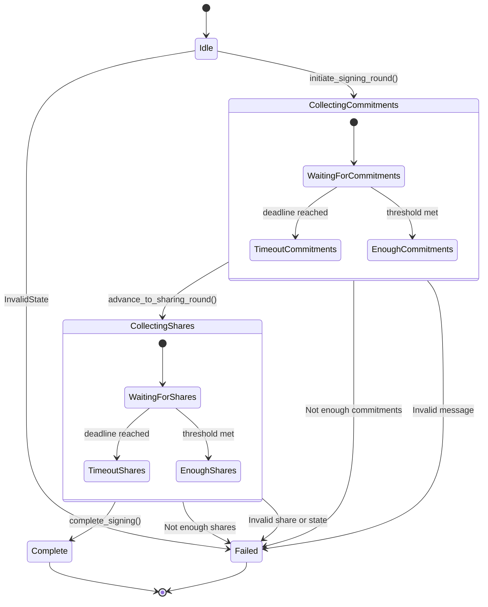

# FROST Demo Application Architecture

## Background

### FROST

FROST protocol is split into two sub-protocols:

1. Key generation / DKG protocol - sets up a signing group so that each party receives a fairly computed and verifiable signing share. In this demo implementation - threshold signatures are generated using a trusted dealer method.
2. Signing protocol - utilises at least `t` of `n` signing shares to construct a signature:
    1. Round 1 - commitment messages for t participants
    2. Round 2 - incomming signature shares

## Separation of Concerns

- FROST demo functions: `spend()` and `generate_keys()` are provided in `lib.rs`

- Business logic: FrostSigner (signer.rs) contains the core business logic of the FROST protocol. It knows what to do when it receives 
    a SigningMessage (collect a commitment, store a share) and how to generate its own commitments and shares. It does 
    not know or care how these messages are sent / received other the network.

- Networking abstraction: Transport trait (transport.rs) defines a contract for communication. The FrostSigner interacts with this 
  abstract interface and not a concrete network implementation. Concrete network implementation is provided in InMemoryTransport that simulates network in memory.

## FROST State Machine

### [signer.rs](signer.rs)

## Observability and Metrics

- Logs: Project is using `tracing` and` tracing-subscriber` which produces structured logs and spans information, see signer.rs run_signing_ceremony() and 
  process_message() which captures session ID and participant ID automatically in the spans and logs.

- Metrics: Project is using prometheus metrics recorder to count number of messages received and processed in the signer.rs (`nonce_commitment`, `signature_share`).

### Assumptions

- Replay attack protection: FROST signer nonce prevent share re-use inside ceremony. Replay protection comes from the Bitcoin layer BIP-341 sighash which commits to a specific transaction

### Limitations / Security Risks

- No share validation
- Dealer trust assumed: key generation and share aggregation for tx signature
- No peer revocation / rotation – once a key package is issued it cannot be disabled or replaced without regenerating the whole group.
- CLI and underlying tx signing only supports a single UTXO input at a time
- Change always returns to the same P2TR key;
- Fee calculation is fixed and no RBF / CPFP - transactions cannot be fee bumped
- FROST Keys are generated using trusted dealer
- Replay-attack surface: ceremony messages are not sequenced or domain separated; an active adversary on the transport could replay a share into another session with the same session ID.
- Timeouts are fixed at 60s - slow or offline peers would stall the entire ceremony.

### TODO

- Verify signature shares when messages are received
- State recovery with persistence
- Implement DKG
- Support multiple input UTXO - add the loop that repeats the signing procedure for every Taproot input in the transaction
